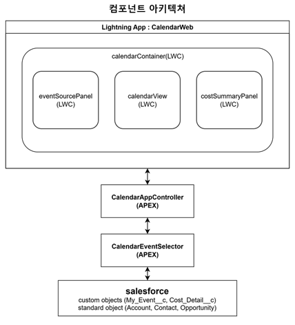

# 일정 관리 및 비용 집계 시스템 요구사항 정의서

- 프로젝트명: Salesforce LWC 기반 일정 관리 및 비용 집계 시스템
- 작성일: 2025-07-10
- 작성자: 박세진
- 버전: 0.1 (초안)

## 목차

1. 소개 (Introduction)
2. 전체 설명 (Overall Description)
3. 시스템 특징 (System Features)
4. 기능적 요구사항 (Functional Requirements)
5. 외부 인터페이스 요구사항 (External Interface Requirements)
6. 비기능적 요구사항 (Non-Functional Requirements)

# 1.소개 (Introduction)
1.1. 문서 목적 (Purpose of the Document)
1.2. 시스템 목표 (System Goals/Objectives)
1.3. 시스템 범위 (System Scope)
1.4. 용어 정의 (Definitions, Acronyms, and Abbreviations)
1.5. 참조 문서 (References)

## 1.1. 문서 목적 (Purpose of the Document)
* 이 문서의 목적은 Salesforce Lightning Web Component (LWC) 기반 일정 관리 및 비용 집계 시스템 개발을 위한 기능적, 비기능적 요구사항을 명확히 정의하는 것입니다.

* 본 문서는 개발 과정의 기준점으로 활용되며, 시스템의 목표와 범위를 명확히 제시하여 효율적인 개발 및 검토를 돕습니다.

* 해당 문서에 작성된 요구사항 ID 규칙 : [ 유형 - 세부분류 - 일련번호 ]
ex : FR-UI-001, CON-G-004

## 1.2. 시스템 목표 (System Goals/Objectives)

* 사용자 친화적인 LWC 기반 일정 관리 기능을 제공합니다
* 사용자 활동(달력에 기록하는 모든 종류의 이벤트 포괄)과 관련된 비용을 체계적으로 입력, 집계, 관리합니다.
* 부서별/월별/비용 종류별 Matrix 타입의 보고서를 제공하여 통합적인 비용 분석을 지원합니다.

## 1.3. 시스템 범위 (System scope)

* **포함 범위 - UI 및 기본구성**
   * **Salesforce Lightning App 내비게이션 탭 구성**: `Home`, `Calendar`, `Reports`, `Settings` 등 애플리케이션의 주요 내비게이션 탭은 Salesforce 표준 탭 또는 커스텀 탭(Custom Tab)을 사용하여 구성됩니다.
        * 탭 구성은 **Lightning App Manager**에서 진행됩니다.

    * **LWC(Lightning Web Component) 기반 UI 개발**: 각 탭 내부의 화면(UI)과 로직은 **Salesforce LWC**로 개발됩니다.
        * FullCalendar 라이브러리를 Salesforce에 Static Resource로 등록하여 LWC에서 활용합니다.

## 1.3. 시스템 범위 (System scope)

* **포함 범위 (In Scope) - 데이터 및 로직**
    * **Custom Object 및 Custom Field 데이터 관리**:
        * 이벤트 정보 저장을 위한 오브젝트 (`Event__c`)를 포함합니다.
        * 비용 상세 정보 저장을 위한 오브젝트 (`Cost_Detail__c`)를 포함합니다.
    * **Apex 클래스 데이터 처리 로직**:
        * 이벤트 및 비용 데이터 CRUD(Create, Read, Update, Delete) 기능을 지원합니다.
        * 비용 데이터의 월별/부서별/비용 유형별 집계 로직을 포함합니다.

## 1.3. 시스템 범위 (System scope)
* **포함 범위 (In Scope) - 기능 및 보고서**

    * **Salesforce 표준 객체 데이터 활용**: `Account`, `Contact`, `Opportunity`와 같은 표준 객체 데이터는 **읽기 전용**으로 활용되어 연관된 이벤트 생성 시 지원됩니다.
    * **사용자 개인 활동 관리 기능**: `휴가`, `병가`, `출장`, `교육` 등 사용자의 개인 활동을 달력에 등록하고 관리하는 기능을 제공합니다.
    * **활동 및 이벤트 관련 비용 입력 및 관리**: 달력에 등록된 모든 활동 및 이벤트에 대한 비용(예: `교통비`, `식대`, `주유비`, `톨게이트`)을 입력하고 관리하는 기능을 포함합니다.
    * **Matrix 타입 보고서 구현**: 월별/부서별/비용 종류별 분석을 위한 **Matrix 타입 보고서** 화면이 LWC와 Apex 연동을 통해 구현됩니다.

<!-- ## 1.3. 시스템 범위 (System scope)
* **제외 범위:**
    * 별도의 외부 Spring Boot 애플리케이션 개발 및 Salesforce와의 연동 작업은 제외됩니다.
    * 외부 관계형 데이터베이스(RDBMS) 연동 및 활용은 제외됩니다.
    * Docker 컨테이너화를 통한 배포 환경 구축은 제외됩니다.
    * Salesforce 외부 RESTful API 개발 및 연동은 제외됩니다. -->

## 1.4. 용어 정의 (Definitions, Acronyms, and Abbreviations)

* **LWC (Lightning Web Component):** Salesforce에서 사용자 인터페이스를 구축하기 위한 최신 프레임워크.
* **Apex:** Salesforce 플랫폼에서 실행되는 객체 지향 프로그래밍 언어. Salesforce 서버에서 비즈니스 로직을 처리하는 데 사용됩니다.
* **Static Resource:** Salesforce에 업로드되어 LWC 등에서 활용할 수 있는 파일(JavaScript, CSS, 이미지 등). 이 프로젝트에서는 FullCalendar 라이브러리 번들을 포함합니다.

## 1.4. 용어 정의 (Definitions, Acronyms, and Abbreviations)

* **Custom Field:** Custom Object 또는 표준 Object에 추가되는 사용자 정의 필드. 비용의 종류와 금액을 저장하는 필드가 최소 두 개 필요합니다.
* **Governor Limits:** Salesforce 플랫폼에서 코드 실행 시 부과되는 리소스 제한 (예: SOQL 쿼리 수, CPU 시간, 힙 크기). Apex 개발 시 반드시 준수해야 합니다.
* **FullCalendar:** 웹 기반 일정 관리 UI를 제공하는 오픈소스 JavaScript 라이브러리. 이 프로젝트의 중앙 달력 구현에 사용됩니다.

<!-- ## 1.5. 참조 문서 (References) -->

# 2. 전체 설명 (Overall Description)
2.1. 사용자 특성 (User Characteristics)
2.2. 운영 환경 (Operating Environment)
2.3. 일반적인 제약사항 (General Constraints)

## 2.1. 사용자 특성 (User Characteristics)

* **주요 사용자 유형:**
    * **일반 사용자 (영업 사원) :** 고객 및 영업 기회 정보를 조회하고 자신의 일정과 관련 비용을 직접 관리하고 입력하는 회사 직원.
    (예: 미팅, 출장, 개인 활동 등)

    * **관리자 :** 부서별 또는 프로젝트별 비용을 집계하고, Matrix 보고서를 통해 비용 현황을 분석하여 의사결정에 활용하는 팀장/부서장급 사용자.
    (예: oo부서별/oo월 비용 집계 보고서)

## 2.2. 운영 환경 (Operating Environment)
    본 시스템은 다음과 같은 환경에서 운영됩니다

* **플랫폼**: Salesforce Lightning Platform
* **개발 프레임워크**: Lightning Web Components (LWC)
* **데이터 저장소**: Salesforce Custom Objects
* **서버 로직**: Apex 클래스
* **클라이언트 라이브러리**: FullCalendar JavaScript 라이브러리 (Static Resource로 업로드)

## 2.3. 일반적 제약사항 (General Constraints)
    본 프로젝트의 개발 및 운영에 영향을 미치는 주요 제약사항은 다음과 같습니다.

* **CON-G-001: Salesforce 플랫폼 제약사항 준수**:
    * Apex 코드 실행 시간, SOQL 쿼리 제한, 메모리 사용량 등 **Salesforce Governor Limits를 반드시 준수**해야 합니다.
    * 대량 데이터 처리 및 집계 로직 구현 시 이러한 제한을 고려해야 합니다.
    * 보고서 및 대시보드의 행 수, 그룹화, 차트 제한 등 **Salesforce의 보고서 관련 제약사항**을 인지하고 설계해야 합니다.
    * 수식 및 필드 관련 제약, 과도한 커스터마이제이션 지양 등 **Salesforce 플랫폼의 일반적인 제약사항**을 고려합니다.

## 2.3. 일반적 제약사항 (General Constraints)
    본 프로젝트의 개발 및 운영에 영향을 미치는 주요 제약사항은 다음과 같습니다.
* **CON-G-002: 기술 스택 및 플랫폼 제한**:
    * 모든 기능은 **Salesforce 플랫폼 내에서만 구현**됩니다.
    * 모든 애플리케이션 데이터는 **Salesforce Custom Objects에 저장**되어야 하며, 외부 데이터베이스 사용은 불가합니다.
    * FullCalendar와 같은 외부 JavaScript 라이브러리는 Salesforce의 **Static Resource로 업로드**하여 LWC에서만 활용됩니다.

## 2.3. 일반적 제약사항 (General Constraints)
    본 프로젝트의 개발 및 운영에 영향을 미치는 주요 제약사항은 다음과 같습니다.
* **CON-G-003: 개발 환경 및 리소스 제약**:
    * 본 프로젝트는 **1인 개발**로 진행되며, 모든 개발 및 문서 작성 작업(요구사항 분석, 설계, 구현, 테스트)을 한 명의 개발자가 수행합니다.
    * Apex 클래스는 배포를 위해 **최소 75% 이상의 코드 커버리지**를 만족하는 테스트 코드가 포함되어야 합니다.

* **CON-G-004: 시간적 제약**:
    * 프로젝트의 개발 및 최종 결과물 제출 기한은 **2025년 7월 23일까지**로 제한됩니다. 

## 2.3. 일반적 제약사항 (General Constraints)
    본 프로젝트의 개발 및 운영에 영향을 미치는 주요 제약사항은 다음과 같습니다.
* **CON-G-005: 사용자 인터페이스 표준 준수**:
    * 시스템의 UI는 Salesforce Lightning Experience 내에서 동작해야 하며, **Salesforce Lightning Design System (SLDS) 표준**을 준수해야 합니다.

# 3. 시스템 특징 (System Features)
### 3.1. 시스템 주요 기능 (Key System Features)

* **LWC 기반 통합 일정 관리**: Salesforce Lightning Experience 환경에서 사용자 친화적인 달력 기반의 일정 생성, 조회, 수정, 삭제 기능을 제공합니다.
* **활동 기반 비용 집계 및 관리**: 고객 미팅, 출장, 개인 활동(예: 휴가, 병가, 출장, 교육 등)과 같이 달력에 등록되는 모든 이벤트에 연관된 비용을 입력하고 체계적으로 관리합니다.
* **Matrix형 비용 분석 보고서**: 월별, 부서별, 비용 종류별로 집계된 데이터를 Matrix 형태로 시각화하여 통합적인 비용 분석 및 현황 파악을 지원합니다.

# 4. 기능적 요구사항 (Functional Requirements)
4.1. 사용자 인터페이스 (UI) 요구사항
4.2. 좌측 패널 (데이터 입력) 기능
4.3. 중앙 달력 (FullCalendar) 기능
4.4. 이벤트 상세/비용 입력 모달 기능
4.5. 우측 패널 (비용 요약) 기능
4.6. 보고서 기능
4.7. 데이터 저장 및 처리 기능

## 4.1. 사용자 인터페이스 (UI) 요구사항

* **FR-UI-001:** 시스템은 Salesforce Lightning Experience 환경에서 동작하는 LWC 기반 페이지로 구성되어야 합니다.
* **FR-UI-002:** 시스템은 [홈], [일정 관리], [보고서], [설정] 등의 메인 애플리케이션 탭을 상단에 제공해야 합니다.
* **FR-UI-003:** [일정 관리] 탭 활성화 시, 좌측 패널 (데이터 입력), 중앙 패널 (달력), 우측 패널 (비용 요약)의 3분할 레이아웃으로 구성되어야 합니다.

## 4.2. 좌측 패널 (데이터 입력) 기능

* **FR-LP-001:** 좌측 패널 상단은 "Salesforce 구성 요소" 영역으로, `Account`, `Contact`, `Opportunity` 탭을 포함하며 각 탭은 현재 로그인한 사용자와 연관된 레코드 목록을 표시해야 합니다.
* **FR-LP-002:** 표시되는 각 `Account`, `Contact`, `Opportunity` 레코드 항목은 중앙 달력으로 **드래그 앤 드롭이 가능**해야 합니다. (읽기 전용 데이터 활용)
* **FR-LP-003:** 좌측 패널 하단은 "개인 & 활동" 영역으로, `휴가`, `병가`, `공가`, `출장`, `교육` 등 로그인한 사용자의 개인 활동 항목들을 표시해야 합니다. 
* **FR-LP-004:** 각 개인 활동 항목은 중앙 달력으로 **드래그 앤 드롭이 가능**해야 합니다.

## 4.3. 중앙 달력 (FullCalendar) 기능

* **FR-FC-001:** 중앙 패널은 FullCalendar 라이브러리를 활용한 월간 보기(Month View) 달력을 표시해야 합니다.
* **FR-FC-002:** 달력 상단/하단에 이전 달/다음 달로 이동할 수 있는 네비게이션 버튼을 제공합니다.
* **FR-FC-003:** 좌측 패널에서 드래그된 항목을 달력의 특정 날짜에 드롭하면 새로운 이벤트가 생성되어야 합니다.

## 4.4. 이벤트 상세/비용 입력 모달 기능

* **FR-MOD-001:** 모달은 이벤트명, 시작일시, 종료일시, 장소, 설명 등 이벤트 기본 정보를 입력/수정할 수 있는 필드를 제공합니다.
* **FR-MOD-002:** 모달은 비용 정보를 입력할 수 있는 섹션을 포함하며, 비용의 종류(`교통비`, `식대`, `주유비`, `톨게이트` 등)를 선택하고 금액을 입력할 수 있어야 합니다.
* **FR-MOD-003:** `+ 비용 추가` 버튼을 통해 하나의 이벤트에 여러 종류의 비용을 추가할 수 있어야 합니다.
* **FR-MOD-004:** 모달은 `저장`, `취소`, `삭제` 버튼을 제공합니다.

## 4.5. 우측 패널 (비용 요약) 기능

* **FR-RP-001:** 우측 패널은 현재 달력에 표시된 월의 비용 종류별 합계를 표시합니다.
<!-- * **FR-RP-002:** 우측 패널은 "비용 종류별 필터" (체크박스)를 제공하여 달력에 표시되는 이벤트를 특정 비용 종류로 필터링할 수 있어야 합니다. -->
* **FR-RP-002:** 우측 패널은 [기간별/부서별 보고서 보기] 버튼을 제공하며, 이 버튼 클릭 시 보고서 페이지로 이동하거나 상세 보고서 모달을 띄웁니다.

## 4.6. 보고서 기능

* **FR-REP-001:** [부서 / 월 / 비용유형별 보고서 보기 ] 버튼 클릭 시, 부서별/월별/비용 종류별 Matrix 타입의 보고서가 표시되어야 합니다.
* **FR-REP-002:** 보고서는 기간 (예: 연도, 월 범위) 및 부서별로 필터링할 수 있는 기능을 제공합니다.
* **FR-REP-003:** 보고서는 집계된 총합을 각 행과 열에 표시해야 합니다.

## 4.7. 데이터 저장 및 처리 기능

* **FR-DS-001:** FullCalendar 이벤트 및 관련 비용 정보는 Salesforce **Custom Object** (`Event__c`) 및 **Custom Field** (`Cost_Type__c`, `Amount__c` 또는 `Cost_Detail__c`)를 통해 저장되어야 합니다.
* **FR-DS-002:** Apex 클래스는 LWC로부터 전달된 데이터를 Custom Object에 저장하고, 조회하며, 수정/삭제하는 로직을 구현해야 합니다.
* **FR-DS-003:** Apex 클래스는 월별 비용 종류별 집계 및 Matrix 보고서 생성을 위한 데이터 처리 로직을 구현해야 합니다.
* **FR-DS-004:** Salesforce 표준 `Account`, `Contact`, `Opportunity` 객체는 좌측 패널에 목록을 제공하는 용도로 **읽기 전용**으로 활용됩니다.

# 5. 외부 인터페이스 요구사항 (External Interface Requirements)
5.1. 사용자 인터페이스 (User Interfaces)
5.2. 소프트웨어 인터페이스 (Software Interfaces)
5.3. 하드웨어 인터페이스 (Hardware Interfaces)
5.4. 통신 인터페이스 (Communications Interfaces)

## 5.1. 사용자 인터페이스 (User Interfaces)

* **EX-UI-001:** 시스템의 사용자 인터페이스는 직관적이고 사용자 친화적인 Salesforce Lightning Design System (SLDS) 가이드라인을 따라야 합니다.
* **EX-UI-002:** 모든 사용자 입력 필드는 명확한 라벨과 유효성 검사 피드백을 제공해야 합니다.
* **EX-UI-003:** 드래그 앤 드롭 동작 시 시각적인 피드백(예: 드래그 중인 항목의 윤곽선, 드롭 가능 영역 표시)을 제공해야 합니다.

## 5.2. 소프트웨어 인터페이스 (Software Interfaces)

* **EX-SW-001:** LWC 컴포넌트는 Salesforce Apex 클래스와 `@AuraEnabled` 메서드를 통해 통신해야 합니다.
* **EX-SW-002:** LWC 컴포넌트는 FullCalendar JavaScript 라이브러리 (Static Resource로 로드)와 상호작용하여 달력 UI 및 기능을 구현해야 합니다.
* **EX-SW-003:** LWC 컴포넌트는 Salesforce 표준 API(예: `lightning-record-form` 또는 `getRecord` 와이어 서비스)를 사용하여 표준 객체(`Account`, `Contact`, `Opportunity`) 데이터를 조회할 수 있습니다.
* **EX-SW-004:** LWC 컴포넌트는 Salesforce Custom Object (`Event__c`, `Cost_Detail__c`)와 Apex를 통해 데이터를 저장하고 조회해야 합니다.

---

### 5.3. 하드웨어 인터페이스 (Hardware Interfaces)

* **EX-HW-001:** 본 시스템은 특정 하드웨어 인터페이스를 요구하지 않는다. 표준 웹 브라우저를 통해 접근 가능합니다.

### 5.4. 통신 인터페이스 (Communications Interfaces)

* **EX-COM-001:** Salesforce 클라이언트(브라우저)와 서버 간의 통신은 Salesforce 표준 HTTPS 프로토콜을 따릅니다.

# 6. 비기능적 요구사항 (Non-Functional Requirements)
6.1. 성능 (Performance)
6.2. 보안 (Security)
6.3. 유용성 (Usability)
6.4. 유지보수성 (Maintainability)
6.5. 신뢰성 (Reliability)
6.6. 호환성 (Compatibility)

---

### 6.1. 성능 (Performance)

* **NFR-PER-001:** 달력 로딩 및 이벤트 표시 시간은 3초 이내여야 합니다.
* **NFR-PER-002:** 이벤트 생성/수정/삭제 및 비용 저장 응답 시간은 2초 이내여야 합니다.
* **NFR-PER-003:** 보고서 조회 시간은 5초 이내여야 합니다. (데이터 양에 따라 조절 가능).

### 6.2. 보안 (Security)

* **NFR-SEC-001:** 시스템은 Salesforce 표준 보안 모델 (프로필, 권한 집합, 공유 설정 등)을 준수해야 합니다.
* **NFR-SEC-002:** 사용자는 본인이 생성한 이벤트 및 비용 정보만 조회, 수정, 삭제할 수 있어야 합니다.

---
### 6.3. 유용성 (Usability)

* **NFR-US-001:** UI는 직관적이고 사용자 친화적이어야 합니다.
* **NFR-US-002:** 드래그 앤 드롭 기능은 부드럽게 작동해야 합니다.

### 6.4. 유지보수성 (Maintainability)

* **NFR-MT-001:** Apex 클래스는 75% 이상의 코드 커버리지를 충족해야 합니다.
* **NFR-MT-002:** 코드는 Salesforce 개발 표준 및 모범 사례를 준수해야 합니다.

---

### 6.5. 신뢰성 (Reliability)

* **NFR-REL-001:** 시스템은 예상치 못한 오류 발생 시 데이터 손실 없이 복구 가능해야 합니다.
* **NFR-REL-002:** 주요 기능(일정 관리, 비용 입력, 보고서 조회)은 안정적으로 동작해야 합니다.

### 6.6. 호환성 (Compatibility)

* **NFR-COM-001:** 시스템은 최신 버전의 Salesforce Lightning Experience 환경에서 동작해야 합니다.
* **NFR-COM-002:** Chrome, Firefox, Edge 등 주요 웹 브라우저에서 정상적으로 작동해야 합니다.

# 기능 구현 현황

## 시스템 구현 범위 (Implementation Scope)

LWE 컴포넌트 구조
- calendarContainer : 부모 컨테이너 (3분할 레이아웃)
- eventSourcePanel : 좌측 데이터 소스 패널
- calendarView : 중앙 FullCalendar 달력
- costSummaryPanel : 우측 비용 요약 및 보고서 패널

## 사용자 인터페이스(UI) 요구사항

| 요구사항ID | 요구사항 내용 | 구현 상태 |구현 상태 |
|:---:|:---:|:---:|:---:|
| `FR-UI-001` | LWC 기반 페이지 구성 | 완료✅ | calendarContainer 메인 컴포넌트 |
| `FR-UI-002` | 메인 애플리케이션 탭 제공 | 완료✅ | CalendarWeb LightningApp |
| `FR-UI-003` | 3분할 레이아웃 구성 | 완료✅ | CSS Flexbox 반응형 레이아웃 |

## 좌측 패널(eventSourcePanel) 기능
| 요구사항ID | 요구사항 내용 | 구현 상태 |구현 상태 |
|:---:|:---:|:---:|:---:|
| `FR-LP-001` | Salesforce 구성 요소 탭 | 완료✅ | Account/Contact/Opportunity |
| `FR-LP-002` | 레코드 드래그 앤 드롭 | 완료✅ | FullCalendar.Draggable API |
| `FR-LP-003` | 개인 & 활동 영역 | 완료✅ | 휴가/병가/출장/교육/회의 |
| `FR-LP-004` | 개인 활동 드래그 앤 드롭 | 완료✅ | FullCalendar.Draggable API |
* 개인 활동 영역중 공가 -> 회의로 변경

## 중앙 달력(calendarView) 기능
| 요구사항ID | 요구사항 내용 | 구현 상태 |구현 상태 |
|:---:|:---:|:---:|:---:|
| `FR-FC-001` | 월간 보기(Month View) | 완료✅ | Fullcalendar API "dayGridMonth" |
| `FR-FC-002` | 달력 네비게이션 버튼 | 완료✅ | 이전/다음/오늘 + 뷰 전환 |
| `FR-FC-003` | 드롭으로 이벤트 생성 | 완료✅ | 자동 모달 오픈, 타입별 분기 |
* 타입별 분기 (isSalesforceObjectEvent | isPersonalActivityEvent)

## 우측 패널(costSummaryPanel)
| 요구사항ID | 요구사항 내용 | 구현 상태 |구현 상태 |
|:---:|:---:|:---:|:---:|
| `FR-RP-001` | 월별 비용 종류별 합계 | 완료✅ | @wire 실시간 집계 |
| `FR-RP-002` | [기간별/부서별 보고서 보기] 버튼 | 완료✅ | NavigationMixin 표준 보고서 |

## 이벤트 상세/ 비용
| 요구사항ID | 요구사항 내용 | 구현 상태 |구현 상태 |
|:---:|:---:|:---:|:---:|
| `FR-MOD-001` | 이벤트 기본 정보 입력 | 완료✅ | Lightning Input 기반 폼 |
| `FR-MOD-001` | 비용 정보 입력 섹션 | 완료✅ | Picklist + Currency 입력 |
| `FR-MOD-001` | 다중 비용 추가 기능 | 완료✅ | addCostItem() 동적 추가 |
| `FR-MOD-001` | 모달 액션 버튼 | 완료✅ | 저장/취소/삭제 |
* 삭제 버튼은 수정 모달창 작동시

## 보고서 기능
| 요구사항ID | 요구사항 내용 | 구현 상태 |구현 상태 |
|:---:|:---:|:---:|:---:|
| `FR-REP-001` | Matrix 타입 보고서 | 완료✅ | Salesforce 표준 보고서 |
| `FR-REP-001` | 필터링 기능 | 완료✅ | 표준 보고서 필터 활용 |
| `FR-REP-001` | 집계 총합 표시 | 완료✅ | Summary 기능 활용 |

## 데이터 저장 및 처리 기능
| 요구사항ID | 요구사항 내용 | 구현 상태 |구현 상태 |
|:---:|:---:|:---:|:---:|
| `FFR-DS-001` | Custom Object 데이터 저장 | 완료✅ | My_Event__c, Cost_Detail__c |
| `FR-DS-001` | Apex CRUD 로직 | 완료✅ | CalendarAppController 구현 |
| `FR-DS-001` | 집계 및 보고서 로직 | 완료✅ | AggregateResult 기반 집계 |
| `FR-DS-001` | 표준 객체 읽기 전용 활용 | 완료✅ | Account/Contact/Opportunity
 |

# 시스템 구조도

# 기술 스택 설명
# 테스트 결과

#### 테스트 실행 결과 요약

| 항목 | 결과 |
|:---:|:---:|
| 전체 테스트 결과 | Passes |
| 총 테스트 수 | 31 |
| 통과율 | 100%|
| 실패율 | 0% |
| 건너뛴 테스트 | 0% |
| 전체 코드 커버리지 | 75% |

#### 클래스별 코드 커버리지 분석
| CLASSES | PERCENT | UNCOVERED LINES 
|:---:|:---:|:---:|
| CalendarAppController | 72% | 46,66,69,76,93,... |
| CalendarEventSelector | 90% | 14,30,48,85,95,... |

# 외부 인터페이스 요구사항(External InterfaceRequirements)

## 사용자 인터페이스 (User Interfaces)
| 요구사항ID | 요구사항 내용 | 구현 상태 |구현 상태 |
|:---:|:---:|:---:|:---:|
| `EX-UI-001` | SLDS 가이드라인 준수 | 완료✅ | Lightning Design System 표준 적용 확인 |
| `EX-UI-002` | 명확한 라벨과 유효성 검사 | 완료✅ | 모든 입력 필드에 라벨 및 검증 로직 구현 |
| `EX-UI-003` | 드래그 앤 드롭 시각적 피드백 | 완료✅ | FullCalendar 라이브러리를 통한 시각적 피드백 제공 |
* 드래그시 해당 레코드가 반투명 상태로 이동 확인

## 소프트웨어 인터페이스 (Software Interfaces)
| 요구사항ID | 요구사항 내용 | 구현 상태 |구현 상태 |
|:---:|:---:|:---:|:---:|
| `EX-SW-001` | LWC-Apex @AuraEnabled 통신 | 완료✅ | Lightning Design System 표준 적용 확인 |
| `EX-SW-002` | FullCalendar 라이브러리 연동 | 완료✅ | 모든 입력 필드에 라벨 및 검증 로직 구현 |
| `EX-SW-003` | 표준 객체 API 사용 | 완료✅ | Account, Contact, Opportunity 조회 테스트 |
| `EX-SW-004` | Custom Object 데이터 처리 | 완료✅ | My_Event__c, Cost_Detail__c CRUD 테스트 |

##
### 하드웨어 인터페이스 (Hardware Interfaces) 
| 요구사항ID | 요구사항 내용 | 구현 상태 |구현 상태 |
|:---:|:---:|:---:|:---:|
| `EX-HW-001` | 표준 웹 브라우저 접근 | 완료✅ | 표준 웹 브라우저를 통해 접근가능 |

### 통신 인터페이스 (Communications Interfaces) 
| 요구사항ID | 요구사항 내용 | 구현 상태 |구현 상태 |
|:---:|:---:|:---:|:---:|
| `EX-COM-001` | HTTPS 프로토콜 준수 | 완료✅ | Salesforce 표준 SSL/TLS 암호화 |

## 비기능 요구 사항

### 성능 (Performance)
| 요구사항ID | 요구사항 내용 | 구현 상태 |구현 상태 |
|:---:|:---:|:---:|:---:|
| `NFR-PER-001` | 달력 로딩 ≤ 3초  | 완료✅ |
| `NFR-PER-002` | 이벤트 저장 ≤ 2초 | 완료✅ |
| `NFR-PER-003` | 보고서 조회 ≤ 5초 | 완료✅ |

### 보안 (Security)
| 요구사항ID | 요구사항 내용 | 구현 상태 |구현 상태 |
|:---:|:---:|:---:|:---:|
| `NFR-SEC-001` | Salesforce 표준 보안 모델 준수 | 완료✅ |프로필/권한 집합 테스트 |
| `NFR-SEC-002` | 사용자별 데이터 접근 제어 | 완료✅ | OwnerId 기반 필터링 검증|
##
### 유용성 (Usability)
| 요구사항ID | 요구사항 내용 | 구현 상태 |구현 상태 |
|:---:|:---:|:---:|:---:|
| `NFR-US-001` | 직관적이고 사용자 친화적 UI  | 완료✅ |드래그 앤 드롭, SLDS 표준|
| `NFR-US-002` | 부드러운 드래그 앤 드롭 | 완료✅ |FullCalendar 네이티브 지원|

### 유지보수성 (Maintainability) 
| 요구사항ID | 요구사항 내용 | 구현 상태 |구현 상태 |
|:---:|:---:|:---:|:---:|
| `NFR-MT-001` | 코드 커버리지 ≥ 75% | 완료✅ |75% 달성 |
| `NFR-MT-002` | 개발 표준 준수 | 완료✅ | |

##
### 신뢰성 (Reliability) 
| 요구사항ID | 요구사항 내용 | 구현 상태 |구현 상태 |
|:---:|:---:|:---:|:---:|
| `NFR-REL-001` | 데이터 손실 없는 복구 | 완료✅ |savepoint/rollback검증|
| `NFR-REL-002` | 주요 기능 안정성 | 완료✅ | 31개 test 통과|

### 호환성 (Compatibility)
| 요구사항ID | 요구사항 내용 | 구현 상태 |구현 상태 |
|:---:|:---:|:---:|:---:|
| `NFR-COM-001` | 최신 버전의 Lightning Experience 호환| 완료✅ | 64.0 API |
| `NFR-COM-002` | 개발 표준 준수 | 완료✅ |주요 브라우저 지원 |

# 개발 결과물 목록
### LWC 컴포넌트
calendarContainer - 메인컨테이너, 모달관리
eventSourcePanel - 드래그 앤 드롭 레코드들
calendarView - Fullcalendar 연동
costSummaryPanel - 비용요약 및 보고서 이동 버튼
### APEX 클래스
CalendarAppController - 주요 비즈니스 로직
CalendarEventSelector - 데이터 조회, 합계게산
CalendarAppControllerTest - 테스트 코드
CalendarEventSelectorTest - 테스트 코드

# 개발 결과물 목록
### Custom Fields (My_Event__c)

- Title__c(Text) 이벤트 제목
- Start_Date__c(Date) 시작일
- End_Date__c(Date) 종료일
- Description__c(Long Text Area) 설명
- Location__(Text) 장소
- Related_Record_Id__c(Text) 연관 레코드
- Related_Record_Type__c(PickList) 레코드 타입

# 개발 결과물 목록
### Custom Fields (Cost_Detail__c)

- My_Event__c(Lookup(My Event)) 상위 이벤트
- Cost_Type__c(PickList) 비용유형
- Amount__c(Currency) 금액
- department__c(Picklist) 부서

# 개발 결과물 목록
### Static Resource
Fullcalendar 5.11.5 - Fullcalendar 라이브러리
### Lightning App
CalendarWeb - 메인 애플리케이션