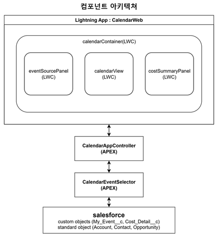
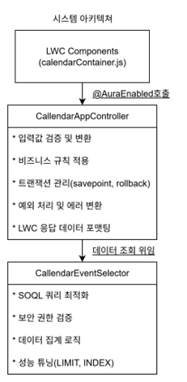

# 일정 관리 및 비용 집계 시스템 프로그램 정의서

- 프로젝트명: Salesforce LWC 기반 일정 관리 및 비용 집계 시스템
- 작성일: 2025-07-23
- 작성자: 박세진
- 버전: 1.0 (최종)

# 목차

### 1. 프로젝트 구성
### 2. 컴포넌트 정리
### 3. 구현 세부사항

# 1. 프로젝트 구성
### 1.1 Apex Classes
### 1.2 LWC Components
### 1.3 Static Resources
### 1.4 Custom Objects

#

### 1.1 Apex Classes (4개)
- CalendarAppController.cls (메인 컨트롤러)
- CalendarEventSelector.cls (데이터 조회 및 합계)
- CalendarAppControllerTest.cls (컨트롤러 테스트)
- CalendarEventSelectorTest.cls (셀렉터 테스트)

### 1.2 LWC Components (4개)
- calendarContainer (메인컨테이너)
- eventSourcePanel (좌측 이벤트 소스 패널)
- calendarView (달력 뷰 패널)
- costSummaryPanel (우측 비용 요약 패널)

#

### 1.3 Static Resources (1개)
- FullCalendarV5_new (FullCalendar 라이브러리)

### 1.4 Custom Objects (2개)
- My_Event__c (이벤트 정보)
- Cost_Detail__c (비용 상세)

# 2. 컴포넌트 정리
### 2.1 Apex Classes
### 2.2 LWC Components
### 2.3 Custom Objects

# 2.1 Apex Classes
### CallendarAppController
역할 : 메인 비즈니스 로직 컨트롤러
특징 : JSON기반 데이터 처리 , EventWrapper클래스(MyEvent + CostDetail + Account Name), savepoint로 트랜잭션 관리

## getEvents(startStr, endStr) 
지정된 날짜 범위 내의 이벤트 목록 조회

<pre>
@AuraEnabled(cacheable=true)
public static List<My_Event__c> getEvents(String startStr, String endStr)
</pre>

###### Returns : `List<My_Event__c>` 날짜 범위에 해당하는 이벤트 목록 (최대 200개)
###### Exceptions : `AuraHandledException` 입력값이 유효하지 않거나 읽기권한이 없을시 발생
###### Description : 지정된 날짜 범위 내의 이벤트 목록 조회 메소드. 현재 로그인한 사용자가 소유한 이벤트만 조회, 시작일과 종료일이 겹치는 모든 이벤트를 반환.
###### Example : calendarView.loadEvents() 메소드에서 호출

| Name | Type | Description |
|:---:|:---:|:---:|
| starStr | String | 조회 시작 날짜(YYYY-MM-DD 형식) |
| endStr | String | 조회 종료 날짜 (YYYY-MM-DD 형식) |

## getEventDetails(eventId) 
특정 이벤트의 상세 정보와 관련 비용 정보 조회

<pre>
@AuraEnabled(cacheable=true)
public static EventWrapper getEventDetails(Id eventId)
</pre>

###### Returns : `EventWrapper` (이벤트+비용+관련레코드)
###### Exceptions : `AuraHandledException` 이벤트ID가 null값, 해당 이벤트를 찾을 수 없는 경우 발생
###### Description : 특정 이벤트와 관련된 모든 비용 정보를 조회. EventWrapper 클래스를 통해 이벤트 객체, 비용 리스트, 관련 레코드명을 함께 반환.
###### Example : calendarContainer.handleEventClick() 메소드에서 호출

| Name | Type | Description |
|:---:|:---:|:---:|
| eventId | Id | 조회할 이벤트 ID |

## getMonthlyCostSummary(startDate, endDate) 
월별 비용 유형별 합계 조회

<pre>
@AuraEnabled(cacheable=true)
public static Map<String, Decimal> getMonthlyCostSummary(String startDate, String endDate)
</pre>

###### Returns : `Map<String, Decimal>` 비용 유형을 key로 하고 합계 금액을 value로 하는 Map
###### Exceptions : `AuraHandledException` 입력값이 유효하지 않거나 읽기권한이 없는 경우 발생
###### Description : 지정된 기간의 비용 유형별 합계를 조회합. 활성화된 모든 Picklist 값을 0으로 초기화한 후, 실제 데이터로 업데이트하여 완전한 집계 결과를 제공.
###### Example : costSummaryPanel.wiredCosts() @wire 메소드에서 호출

| Name | Type | Description |
|:---:|:---:|:---:|
| startDate | String | 조회 시작 날짜(YYYY-MM-DD 형식) |
| endDate | String | 조회 종료 날짜 (YYYY-MM-DD 형식) |

## saveEventAndCosts(eventDataJson, costDetailsJson) 
이벤트 관련 비용 정보 JSON저장 (LWC에서 호출하는 public 메소드)

<pre>
@AuraEnabled
public static String saveEventAndCosts(String eventDataJson, String costDetailsJson)
</pre>

###### Returns : `String` 저장된 이벤트의 Salesforce ID
###### Exceptions : `AuraHandledException` 이벤트 데이터가 없거나 JSON 파싱 오류, 저장 중 오류가 발생한 경우
###### Description : JSON 방식으로 이벤트 및 비용 정보를 저장. 기존 이벤트 수정과 신규 이벤트 생성을 모두 지원, Savepoint를 사용한 트랜잭션 관리로 데이터 일관성을 보장.
###### Example : calendarContainer.saveEvent() 메소드에서 호출

| Name | Type | Description |
|:---:|:---:|:---:|
| eventDataJson | String | 이벤트 기본 정보가 담긴 JSON 문자열 |
| costDetailsJson | String | 비용 상세 정보 배열이 담긴 JSON 문자열 |

## updateEventDates(eventId, newStartDate, newEndDate)
기존 이벤트 시작일 종료일 업데이트

<pre>
@AuraEnabled
public static void updateEventDates(Id eventId, String newStartDate, String newEndDate)
</pre>

###### Returns : `void`
###### Exceptions : `AuraHandledException` 이벤트 ID가 null이거나 수정 권한이 없는 경우 발생
###### Description : 기존 이벤트의 시작일과 종료일만 업데이트. 주로 캘린더에서 이벤트를 드래그로 이동할 때 사용, 소유권 검증을 통해 보안을 보장.
###### Example : calendarView.handleEventDrop() 메소드에서 호출

| Name | Type | Description |
|:---:|:---:|:---:|
| eventId | Id | 업데이트할 이벤트 ID |
| newStartDate | String | 새로운 시작일 (YYYY-MM-DD) |
| newEndDate | String | 새로운 종료일 (YYYY-MM-DD) |

## deleteEvent(eventId)
이벤트 관련 비용 정보 삭제 메소드

<pre>
@AuraEnabled
public static void deleteEvent(Id eventId)
</pre>

###### Returns : `void`
###### Exceptions : `AuraHandledException` 이벤트 ID가 null이거나 삭제 권한이 없는 경우 발생
###### Description : 이벤트와 관련된 모든 비용 정보를 삭제. Savepoint를 사용하여 트랜잭션 관리, 오류 발생 시 모든 변경사항을 롤백.
###### Example : calendarContainer.handleDelete() 메소드에서 호출

| Name | Type | Description |
|:---:|:---:|:---:|
| eventId | Id | 삭제할 이벤트ID |

## getAccountList(), getContactList(), getOpportunityList()
Account, Contact, Opportunity 리스트 목록 조회

<pre>
@AuraEnabled(cacheable=true)
public static List<오브젝트> get오브젝트List()
</pre>

###### Returns : Account, Contact, Opportunity 목록 (Limit 200)
###### Exceptions : `AuraHandledException` 읽기권한이 없을 시 발생
###### Description : 목록은 주어진 조건순으로 조회4
###### Example : eventSourcePanel.`[accountData , contactData , opportunityData]`  getter에서 @wire를 통해 호출

## getDepartmentOptions()
부서 옵션 picklist 목록 조회

<pre>
@AuraEnabled(cacheable=true)
public static List<Map<String, String>> getDepartmentOptions()
</pre>

###### Returns : `List<Map<String, String>>` label과 value를 포함하는 부서 옵션 리스트
###### Exceptions : `AuraHandledException` 부서 옵션 조회 중 오류가 발생한 경우
###### Description : Cost_Detail__c.department__c 필드의 활성 Picklist 옵션을 조회. 이후 모달의 부서 선택 콤보박스에서 사용
###### Example : calendarContainer.connectedCallback() 메소드에서 호출

## getCostTypeOptions()
비용 옵션 picklist 목록 조회

<pre>
@AuraEnabled(cacheable=true)
public static List<Map<String, String>> getCostTypeOptions()
</pre>

###### Returns : `List<Map<String, String>>` label과 value를 포함하는 비용 유형 옵션 리스트
###### Exceptions : `AuraHandledException` 비용 유형 옵션 조회 중 오류가 발생한 경우
###### Description : Cost_Detail__c.Cost_Type__c 필드의 활성 Picklist 옵션을 조회. 이후 모달의 비용 유형 선택 콤보박스에서 사용.
###### Example : calendarContainer.connectedCallback() 메소드에서 호출

# 2.1 Apex Classes
### CalendarEventSelector
역할 : 데이터 조회 전용
특징 : SOQL 쿼리 전담, CRUD 권한 검증 강화, AggregateResult 활용 집계

## selectEventsByDateRange(startDt, endDt)
지정된 날짜 범위별 이벤트 목록 조회

<pre>
public static List<My_Event__c> selectEventsByDateRange(Date startDt, Date endDt)
</pre>

###### Returns : `List<My_Event__c>` 날짜 범위에 해당하는 이벤트 목록 (현재 사용자 소유, LIMIT 200)
###### Exceptions : `AuraHandledException` 날짜가 null이거나 읽기 권한이 없는 경우
###### Description : 지정된 날짜 범위의 이벤트 목록을 조회. 현재 사용자 소유 이벤트만 조회하며 시작일 기준으로 정렬
###### Example : CalendarAppController.getEvents() 메소드에서 호출

| Name | Type | Description |
|:---:|:---:|:---:|
| startDt | Date | 조회 시작 날짜 |
| endDt | Date | 조회 시작 날짜 |

## selectMonthlyCostSummary(startDate, endDate)
지정된 기간의 비용 유형별 합계 조회

<pre>
public static Map<String, Decimal> selectMonthlyCostSummary(Date startDate, Date endDate)
</pre>

###### Returns : `Map<String, Decimal>` 비용 유형별 합계 Map (활성 Picklist 포함)
###### Exceptions : `AuraHandledException` 날짜가 null이거나 읽기 권한이 없는 경우
###### Description : 지정 기간의 비용 유형별 합계를 조회. Picklist 값으로 초기화 후 AggregateResult로 실제데이터 병합하여 완전한 집계 결과 제공
###### Example : CalendarAppController.getMonthlyCostSummary() 메소드에서 호출

| Name | Type | Description |
|:---:|:---:|:---:|
| startDate | Date | 조회 시작 날짜 |
| endDate | Date | 조회 시작 날짜 |

# 2.2 LWC Component
### calendarContainer
역할 : 메인 컨테이너 이벤트 조정자
특징 : 3분할 레이아웃 관리, 모달 상태 관리, 이벤트CRUD 및 컴포넌트 간 데이터 동기화

## connectedCallback()
컴포넌트 초기화 및 부서/비용 타입 옵션 로드

<pre>
async connectedCallback()
</pre>

###### Returns : `void`
###### Exceptions : 부서/비용 옵션 조회 실패 시 토스트 메시지 표시
###### Description : 컴포넌트 초기화 시 부서 및 비용 유형 Picklist 옵션을 Apex에서 조회하여 로드. getDepartmentOptions와 getCostTypeOptions를 호출하여 저장.
###### Example : 컴포넌트 렌더링 시 자동 호출

## handleEventDrop(event)
드래그 드롭시 새 이벤트 생성

<pre>
handleEventDrop(event)
</pre>

###### Returns : `void`
###### Exceptions : 처리 중 오류 발생 시 토스트 메시지 표시
###### Description : 드래그 드롭으로 새 이벤트 생성 시 호출. 드롭된 레코드의 데이터를 기반으로 이벤트 기본 정보 설정 및 모달창 표시
###### Example : 좌측 패널에서 특정 레코드 중앙 달력 패널에 드롭시 호출

| Name | Type | Description |
|:---:|:---:|:---:|
| event | CustomEvent | 드래그 드롭 이벤트 객체 (detail.draggedEl, detail.date 포함) |

## handleEventClick(event)
기존 이벤트 클릭시 상세 정보 조회

<pre>
async handleEventClick(event)
</pre>

###### Returns : `void`
###### Exceptions : 이벤트 데이터 조회 실패 시 토스트 메시지 표시
###### Description : 기존 이벤트 클릭시 getEventDetails Apex메소드를 호출하여 이벤트, 비용 정보 조회, 조회한 데이터로 모달 초기화를 한뒤 수정 모드로 표시
###### Example : calendarView에서 이벤트 클릭 시 호출

| Name | Type | Description |
|:---:|:---:|:---:|
| event | CustomEvent | 이벤트 클릭 객체 (detail.eventId 포함) |

## saveEvent()
이벤트 및 비용 정보 저장

<pre>
async saveEvent()
</pre>

###### Returns : `void`
###### Exceptions : 제목이 비어있는 경우 또는 저장 실패시 오류 토스트 메시지 표시
###### Description : 모달에 입력된 정보를 JSON형태로 구성하여 Apex 메소드를 통해 저장, 성공시 달력 뷰 업데이트 및 비용 패널 새로고침
###### Example : 사용자가 이벤트 생성/수정 모달에서 Save 버튼을 클릭할 때 실행

# 2.2 LWC Component
### eventSourcePanel
역할 : 좌측 이벤트 소스 패널
특징 : 드래그 기능 구현 및  @wire를 통한 자동 데이터 로딩, 탭 기반 데이터 분류

## renderedCallback()
FullCalendar 로드 후 드래그 기능 초기화

<pre>
async renderedCallback()
</pre>

###### Returns : `void`
###### Exceptions : FullCalendar 로드 실패 시 콘솔 에러 출력
###### Description : 컴포넌트가 렌더링된 후 FullCalendar 스크립트를 로드하고 드래그 기능을 초기화
###### Example : 죄측 패널이 로드시 실행되어 좌측 레코드들이 드래그 가능하게 만듬

## initializeExternalDraggables()
드래그 가능한 요소들 초기화

###### Returns : `void`
###### Exceptions : FullCalendar 초기화 실패시 경고 로그 및 드래그 초기화 실패시 콘솔에러
###### Description : 좌측 레코드들을 FullCalendar Draggable로 설정, 기존 드래그 인스턴스 정리 후 새로운 인스턴스 생성
###### Example : 컴포넌트 초기화 또는 좌측 패널 상단의 탭 변경시 호출하여 드래그 가능하도록 설정

## getEventData(eventEl)
드래그 가능한 요소들 초기화

###### Returns : `Object | null` FullCalendar 이벤트 데이터 객체 또는 null
###### Exceptions : 요소나 데이터 셋, 레코드 명이 없는 경우 null 반환
###### Description : 드래그된 DOM 요소의 data 속성들을 읽어 FullCalendar에서 사용할 이벤트 데이터 객체를 생성
###### Example : 사용자가 좌측 레코드 드래그시 Fullcalendar에 의해 자동 호출

| Name | Type | Description |
|:---:|:---:|:---:|
| eventEl | HTMLElement | 드래그된 DOM 요소 |

# 2.2 LWC Component
### calendarView
역할 : 중앙 달력 뷰 패널
특징 : FullCalendar 라이브러리 연동, 드래그앤드롭 처리

## renderedCallback()
이벤트 및 비용 정보 저장

###### Returns : `void`
###### Exceptions : 이미 초기화된 경우 조기 반환, FullCalendar 로드 실패시 콘솔에러 출력
###### Description : 컴포넌트가 렌더링 된 후 FullCalendar라이브러리를 로드하고 초기화
###### Example : 컴포넌트가 처음 DOM에 렌더링될 때 자동으로 실행되어 달력 UI를 구성

## loadEvents()
이벤트 데이터 조회

<pre>
async loadEvents(fetchInfo, successCallback, failureCallback)
</pre>

###### Returns : `void`
###### Exceptions : 날짜 정보 올바르지 않을시, 이벤트 로드 실패시 (failureCallback 호출)
###### Description : 지정된 날짜 범위 이벤트 조회, FullCalendar 형식으로 변환
###### Example : 달력이 초기 로드 또는 사용자가 월을 변경할 때 FullCalendar에 의해 자동 호출

| Name | Type | Description |
|:---:|:---:|:---:|
| fetchInfo | Object | FullCalendar에서 제공하는 날짜 범위 정보 |
| successCallback | Function | 성공 시 호출할 콜백 함수 |
| failureCallback | Function | 실패 시 호출할 콜백 함수 |

## handleEventDrop()
이벤트 드래그 이동 처리 및 업데이트

<pre>
async handleEventDrop(info)
</pre>

###### Returns : `void`
###### Exceptions : 업데이트 실패시 이벤트 되돌리기 및 에러 이벤트 발생
###### Description : 달력내 드래그 드롭시 실행. Apex 메소드를 사용해 이벤트 날짜 업데이트(날짜 변경)
###### Example : 달력내 드래그 드롭시 실행

| Name | Type | Description |
|:---:|:---:|:---:|
| info | Object | FullCalendar 드롭 정보 객체 |

# 2.2 LWC Component
### costSummaryPanel
역할 : 우측 비용 요약 패널
특징 : 월별 비용 종류별 합계 , matrix 보고서

## wiredCosts()
월별 비용 데이터 자동 조회 및 처리

<pre>
@wire(getMonthlyCostSummary, { startDate: '$monthRange.start', endDate: '$monthRange.end' })
wiredCosts(result)
</pre>

###### Returns : `void`
###### Exceptions : 데이터 처리 오류시 또는 조회 오류시 에러 로그 및 토스트 메시지
###### Description : Lightning Web Component의 @wire 데코레이터를 사용하여 월별 비용 데이터를 자동으로 조회, 또한 데이터 변경 시 자동으로 재조회되며, 결과를 처리하여 화면에 표시.
###### Example : 월 변경 또는 비용 데이터 업데이트시 실행

| Name | Type | Description |
|:---:|:---:|:---:|
| result | Object | Wire 서비스 결과 객체 (data 또는 error 포함) |

## refreshSummary()
비용 요약 데이터 새로고침

<pre>
@api async refreshSummary()
</pre>

###### Returns : `void`
###### Exceptions : 새로고침 실패 시 토스트 메시지 표시
###### Description : @wire 서비스를 수동으로 새로고침하여 최신 비용 데이터 조회
###### Example : 이벤트를 저장하거나 삭제한 후 calendarContainer에서 호출하여 비용 요약을 업데이트

# 2.3 Custom Objects

### My_Event__c

| Field Name            | Type                | Description             |
|:----------------------|:--------------------|:-------------------------|
| Event Name            | Text(80)            | 기본 이름 필드             |
| Title__c              | Text(80)            | 이벤트 제목                |
| Start_Date__c         | Date                | 시작일                    |
| End_Date__c           | Date                | 종료일                    |
| Description__c        | Long Text Area()    | 이벤트 설명               |
| Location__c           | Text(255)           | 장소                     |
| Related_Record_Id__c  | Text(18)            | 관련 레코드 ID            |
| Related_Record_Type__c| Picklist            | 관련 레코드 타입           |
| CreatedById           | Lookup(User)        | 생성자 (시스템 필드)       |
| LastModifiedById      | Lookup(User)        | 최근 수정자 (시스템 필드)   |
| OwnerId               | Lookup(User,Group)  | 소유자                    |

### Cost_Detail__c

| Field Name            | Type                | Description             |
|:----------------------|:--------------------|:-------------------------|
| Amount__c             | Currency(16, 2)     | 비용 금액                |
| Name                  | Text(80)            | 레코드명                 |
| Cost_Type__c          | Picklist            | 비용 유형                |
| CreatedById           | Lookup(User)        | 시스템 필드              |
| department__c         | Picklist            | 부서                     |
| Event__c              | Lookup(My_Event__c) | 이벤트 관계              |
| LastModifiedById      | Lookup(User)        | 시스템 필드              |
| My_Event__c           | Lookup(My_Event__c) | 메인 이벤트 관계         |
| Note__c               | Text(255)           | 메모                     |
| OwnerId               | Lookup(User,Group)  | 소유자                   |

ㄴ

## Picklist 값 정의

##### Cost_Type__c 비용 유형
- Transportation (교통비)
- Education (교육비)
- Fuel (주유비)
- Meal (식대)
- TollGate (톨게이트)

##### department__c 부서 유형
- Development (개발팀)
- Sales (영업팀)
- Marketing (마케팅팀)
- Planning (기획팀)

##### Related_Record_Type__c
- Account
- Contact
- Opportunity
- Personal

# 3. 구현 세부사항
### 3.1 시스템 구조도
### 3.2 시스템 흐름도
### 3.3 요구사항 이행 결과

# 시스템 구조도

# 시스템 구조도

# 요구사항 이행 결과

#### 사용자 인터페이스(UI) 요구사항

| 요구사항ID | 요구사항 내용 | 구현 상태 |구현 상태 |
|:---:|:---:|:---:|:---:|
| `FR-UI-001` | LWC 기반 페이지 구성 | 완료✅ | calendarContainer 메인 컴포넌트 |
| `FR-UI-002` | 메인 애플리케이션 탭 제공 | 완료✅ | CalendarWeb LightningApp |
| `FR-UI-003` | 3분할 레이아웃 구성 | 완료✅ | CSS Flexbox 반응형 레이아웃 |

## 좌측 패널(eventSourcePanel) 기능

| 요구사항ID | 요구사항 내용 | 구현 상태 |구현 상태 |
|:---:|:---:|:---:|:---:|
| `FR-LP-001` | Salesforce 구성 요소 탭 | 완료✅ | Account/Contact/Opportunity |
| `FR-LP-002` | 레코드 드래그 앤 드롭 | 완료✅ | FullCalendar.Draggable API |
| `FR-LP-003` | 개인 & 활동 영역 | 완료✅ | 휴가/병가/출장/교육/회의 |
| `FR-LP-004` | 개인 활동 드래그 앤 드롭 | 완료✅ | FullCalendar.Draggable API |
* 개인 활동 영역중 공가 -> 회의로 변경

## 중앙 달력(calendarView) 기능
| 요구사항ID | 요구사항 내용 | 구현 상태 |구현 상태 |
|:---:|:---:|:---:|:---:|
| `FR-FC-001` | 월간 보기(Month View) | 완료✅ | Fullcalendar API "dayGridMonth" |
| `FR-FC-002` | 달력 네비게이션 버튼 | 완료✅ | 이전/다음/오늘 + 뷰 전환 |
| `FR-FC-003` | 드롭으로 이벤트 생성 | 완료✅ | 자동 모달 오픈, 타입별 분기 |
* 타입별 분기 (isSalesforceObjectEvent | isPersonalActivityEvent)

## 우측 패널(costSummaryPanel)
| 요구사항ID | 요구사항 내용 | 구현 상태 |구현 상태 |
|:---:|:---:|:---:|:---:|
| `FR-RP-001` | 월별 비용 종류별 합계 | 완료✅ | @wire 실시간 집계 |
| `FR-RP-002` | [기간별/부서별 보고서 보기] 버튼 | 완료✅ | NavigationMixin 표준 보고서 |

## 이벤트 상세/ 비용
| 요구사항ID | 요구사항 내용 | 구현 상태 |구현 상태 |
|:---:|:---:|:---:|:---:|
| `FR-MOD-001` | 이벤트 기본 정보 입력 | 완료✅ | Lightning Input 기반 폼 |
| `FR-MOD-001` | 비용 정보 입력 섹션 | 완료✅ | Picklist + Currency 입력 |
| `FR-MOD-001` | 다중 비용 추가 기능 | 완료✅ | addCostItem() 동적 추가 |
| `FR-MOD-001` | 모달 액션 버튼 | 완료✅ | 저장/취소/삭제 |
* 삭제 버튼은 수정 모달창 작동시

## 보고서 기능
| 요구사항ID | 요구사항 내용 | 구현 상태 |구현 상태 |
|:---:|:---:|:---:|:---:|
| `FR-REP-001` | Matrix 타입 보고서 | 완료✅ | Salesforce 표준 보고서 |
| `FR-REP-001` | 필터링 기능 | 완료✅ | 표준 보고서 필터 활용 |
| `FR-REP-001` | 집계 총합 표시 | 완료✅ | Summary 기능 활용 |

## 데이터 저장 및 처리 기능
| 요구사항ID | 요구사항 내용 | 구현 상태 |구현 상태 |
|:---:|:---:|:---:|:---:|
| `FFR-DS-001` | Custom Object 데이터 저장 | 완료✅ | My_Event__c, Cost_Detail__c |
| `FR-DS-001` | Apex CRUD 로직 | 완료✅ | CalendarAppController 구현 |
| `FR-DS-001` | 집계 및 보고서 로직 | 완료✅ | AggregateResult 기반 집계 |
| `FR-DS-001` | 표준 객체 읽기 전용 활용 | 완료✅ | Account/Contact/Opportunity